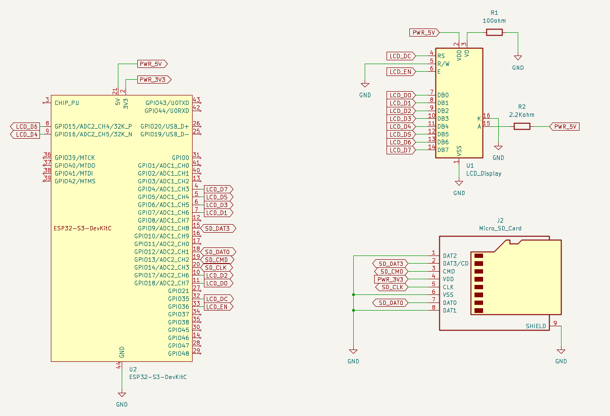

# bapple-lcd

"Bad Apple!!" displayed on a 20x4 character LCD at 7.5fps, using an ESP32-S3 microcontroller and an SD card.

## Video demonstration

## How it was made

Character LCDs have the capability of showing up to 8 different user-defined characters, which is a good amount, though it is obviously not enough to display a single 8 cols x 4 rows frame (this requires 32 custom characters!). However, it is possible to create the illusion of more custom characters through a technique called multiplexing, which in this case consists of loading 8 characters for a row, displaying the row, clearing the screen, then repeating this for all 4 rows. Because the LCD isn't capable of erasing everything in the screen immediately, and because the motion is too fast for the human eye to notice such sudden changes, all of the rows appear to be displayed at the same time, creating the illusion.

## Schematic diagram

## Additional notes

- The SD card must be formatted as FAT32.
- The data.bin file, which contains video data, must be placed at `/lcd-bapple/data.bin` in the SD card.
- To achieve higher read speeds, the firmware sets up the SD card on 1-bit SDIO mode, which means certain generic SD card modules that are meant to be used with SPI (such as [this one](https://www.mreeco.com/DataImages/Products/637719080476634797_1large.webp) and [this one](https://www.robotpark.com/image/cache/data/PRO/91412/91412-SD-Card-Module-pic01-700x700.PNG)) may not work, as DAT2 and DAT3 must be grounded for the SD card to be initialized successfully, and most SD modules designed for SPI in mind do not expose these pins at all. There are three possible solutions to this:
  1. Buy a proper SD card breakout board that exposes all pins, preferably without any extra components such as linear regulators, level shifters and resistors. These are typically hard to find, as SDIO isn't widely used for DIY projects. You could also buy a socket and then make the breakout board yourself, but this obviously requires a lot more work.
  2. Get a generic SPI SD card module and solder wires for DAT2 and DAT3 directly from the socket. I haven't tried this myself but it may be a viable solution.
  3. Solder wires on each contact of a microSD-to-SD adapter. This is what I personally went with, and it works really well.
- It is possible that the SD card will need to be powered with an external power supply, as SD cards consume more power when working on SDIO mode. If you do use a different power supply for the SD card, make sure to connect the grounds (-) of the ESP32's and the SD card's power supplies together to ensure a common ground, otherwise you'll get a CRC error upon initialization.
